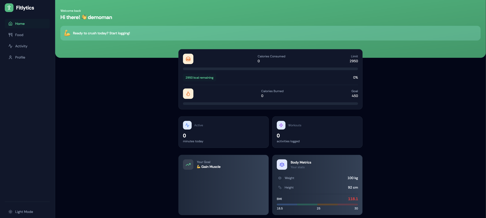
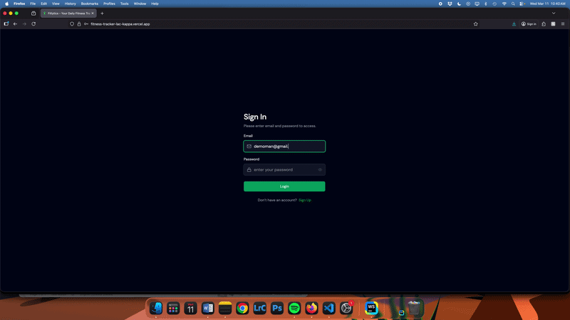

# 🚀 Fitlytics | AI-Powered Fitness Tracker

<p align="center">
  
</p>

<h3 align="center">Fitlytics | AI-Powered Fitness Tracker</h3>

Track your fitness journey, set goals, log meals and workouts, and get **AI-powered insights** on the foods you eat by simply uploading images. Fully deployable online for free.

---

# 🎥 Demo

<p align="center">
  
</p>

---

# 📌 Problem

Many fitness apps track workouts or food intake, but **users lack personalized AI-powered analysis** of the foods they eat. Additionally, integrating food tracking, calorie calculation, and AI insights usually requires multiple apps or manual input, making the process slow and inconvenient.

---

# ✅ Solution

Fitlytics combines a **React frontend**, **Strapi backend**, and **Google Gemini AI** to provide a full-stack, AI-enhanced fitness tracker. Users can:

- Set daily fitness goals  
- Track food intake and calorie consumption  
- Log fitness activities and calories burned  
- Upload food images to get AI-based nutritional insights  

All data is persistently stored via Strapi and can be accessed and managed through the dashboard, providing **a seamless full-stack experience**.

---

# 🧑‍💻 Technologies Used

| Layer          | Technology                                |
| -------------- | ----------------------------------------- |
| Frontend       | React JS, Tailwind CSS                    |
| Backend        | Strapi (Headless CMS)                     |
| AI Integration | Google Gemini AI                          |
| Deployment     | Vercel (Frontend), Strapi Cloud (Backend)|

---

# 🔥 Key Features

- ✅ Set daily fitness goals  
- ✅ Track food intake (calories consumed)  
- ✅ Track fitness activities (calories burned)  
- ✅ User authentication (Sign up / Sign in)  
- ✅ Update user profile data  
- ✅ AI-powered food tracking via image uploads  
- ✅ Food image analysis using Google Gemini AI  
- ✅ Free online deployment (Frontend + Backend)

---

# 🧠 Technical Decisions

### Why React + Tailwind CSS?

React provides a **component-based architecture** for building the dynamic dashboard, while Tailwind CSS enables **rapid styling and responsive design**.

### Why Strapi?

Strapi offers a **headless CMS backend**, allowing flexible data management, secure authentication, and scalable API endpoints for storing user and fitness data.

### Why Google Gemini AI?

Google Gemini powers the **food image analysis**, providing accurate calorie and nutrient estimation from uploaded images, giving users actionable insights.

### Deployment Decisions

Frontend is deployed on **Vercel** for fast, scalable hosting, and backend on **Strapi Cloud** to handle API requests and persistent storage.

---

# 📦 Core Modules

### Frontend

- Dashboard & Navigation
- Profile Management
- Food and Fitness Tracking
- AI Image Upload and Analysis

### Backend

- User Authentication & Management
- Fitness Data Storage
- Food Tracking API
- AI Integration Layer

---

# 🎯 Learning Outcomes

Through building Fitlytics, I:

- Developed a **full-stack React + Strapi application**  
- Integrated **AI model APIs** for real-time food analysis  
- Built **user authentication and profile management systems**  
- Implemented **responsive UI with Tailwind CSS**  
- Managed **backend data storage and API endpoints**  
- Learned deployment workflows for **frontend and backend services**

---

# 🚀 Running the Project Locally

Clone the repository:

```bash
git clone https://github.com/yourusername/fitlytics.git

- Navigate into the project
cd fitlytics

- Install frontend dependencies:
cd frontend
npm install

- Start frontend
npm run dev

- Install backend dependencies:
cd ../backend
npm install

- Start Strapi backend:
npm run develop

- Frontend will run at:
http://localhost:5173

- Backend (Strapi) will run at:
http://localhost:1337